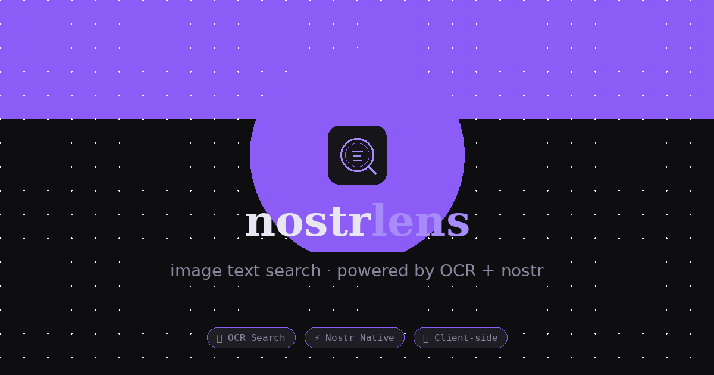

# nostrlens

**Search text inside images on Nostr using OCR.**

nostrlens connects to your Nostr relays, fetches image posts, runs optical character recognition (OCR) on every image entirely in your browser, and lets you search through the extracted text. No server, no backend, no data ever leaves your device.

---

## What it does

- Loads your identity from an `npub` or `nsec` (private key never leaves your browser)
- Fetches your NIP-65 relay list automatically when you load your identity
- Connects to Nostr relays via WebSocket and pulls image-containing events (kind 1 and kind 20)
- Runs Tesseract.js OCR on each image locally in your browser
- Builds a searchable index stored in `sessionStorage`
- Lets you search that index by the words and phrases found inside images
- Highlights matching text directly on the image thumbnails
- Filter results by last 7 days, last 30 days, or your own posts only

---

## How to use

1. Enter your `npub1…` or `nsec1…` in the Identity field and click **Load**
   - Your NIP-65 relay list will be fetched automatically
2. Click **Connect all** to open WebSocket connections to your relays
3. Click **Fetch + OCR** to pull image events and run OCR on each one
   - A progress bar tracks how many images have been processed
   - The grid updates live as images are indexed
4. Type any word or phrase in the search box and click **Search** (or press Enter)
5. Click any image card to see the full extracted text and open the original

---

## Tech

| Piece | What it does |
|---|---|
| [nostr-tools v2.7](https://github.com/nbd-wtf/nostr-tools) | NIP-19 key decoding, event handling |
| [Tesseract.js v5.1](https://tesseract.projectnaptha.com/) | In-browser OCR engine |
| Native WebSocket | Relay connections (no extra library) |
| `sessionStorage` | Persists the image index for the current tab session |

No build step, no framework, no dependencies to install. It is a single HTML file.

---

## Privacy

- Your `nsec` is decoded in memory only and is never sent anywhere
- All OCR processing happens locally in your browser via WebAssembly
- No analytics, no tracking, no external requests beyond your chosen relays and the CDN scripts loaded on page open

---

## Deployment

This project is a single `index.html` file (plus `og-preview.png` for link previews). It can be hosted on any static file host.

**Cloudflare Pages (recommended)**

1. Push `index.html` and `og-preview.png` to a GitHub repo
2. Go to Cloudflare Dashboard → Workers & Pages → Create → Pages
3. Connect your GitHub repo
4. Set framework preset to **None**, leave build command and output directory blank
5. Click **Save and Deploy**

You will get a free `*.pages.dev` URL with automatic redeployment on every push.

---

## Files

```
index.html       — the full app
og-preview.png   — social preview image for link unfurling
README.md        — this file
```

---

## License

MIT
